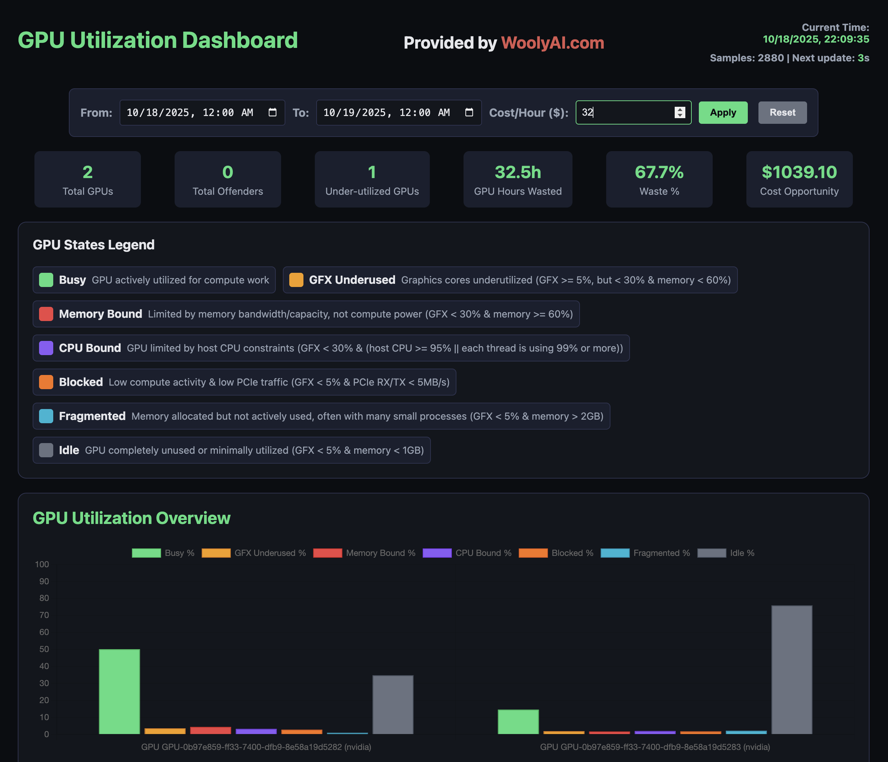

## What is the WoolyAI GPU Auditor?

The WoolyAI GPU Auditor is a tool that allows you to audit your GPU usage and identify potential inefficiencies. It is a web application that you can run on your GPU host.

Not only does it provide a UI for visualizing GPU usage, but it also provides a report API for querying GPU usage data.

You can find the GPU Auditor UI tool on [Github](https://github.com/Wooly-AI/gpu-auditor).

Usage instructions are available in the [Github repository](https://github.com/Wooly-AI/gpu-auditor?tab=readme-ov-file#usage).