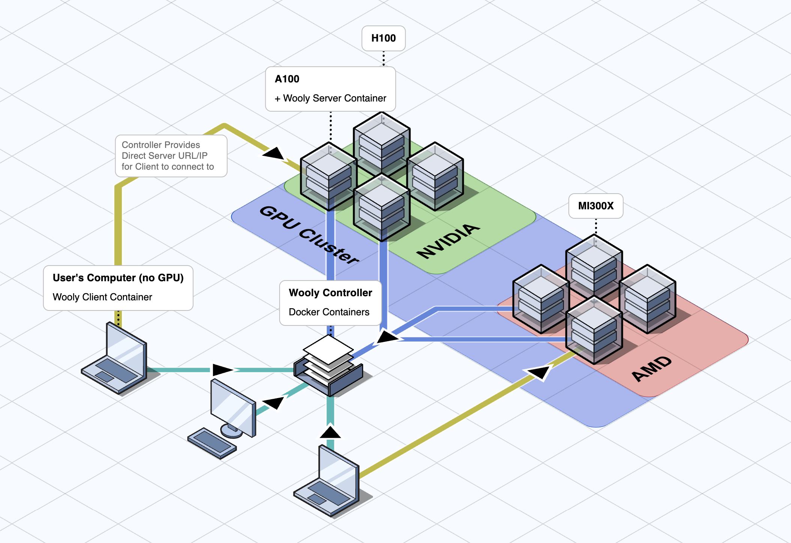

## What is WoolyAI?

WoolyAI is a GPU hypervisor for ML giving portability, high utilization, and concurrency without changing your existing CUDA code. It lets you develop/run CUDA/PyTorch apps anywhere (even CPU-only) while the actual kernels run remotely on AMD or NVIDIA GPUs. It compiles your kernels into a **[Wooly Instruction Set ("WIS")](../glossary#wooly-instruction-set-wis)** on the client, then JIT compiles to native CUDA or ROCm on the GPU server.

- **Vendor-agnostic execution**: Same Unified ML container to run on NVIDIA or AMD backends.
- **Client/server split**:
    - **Wooly Client** (in your dev container/laptop) captures CUDA kernels → emits WIS.
    - **Wooly Server** (hypervisor) on GPU nodes converts WIS → native GPU ISA and executes.
- **Dynamic scheduling**: Measures and allocates at runtime GPU cores/VRAM across tenants with deterministic scheduling options.
- **Memory efficiency**: VRAM dedup (e.g., shared base weights across many LoRA adapters) to pack more models per GPU.
- **Ecosystem-friendly**: Works with PyTorch, vLLM, etc.—no model/code rewrites.

### Advantages

- **No GPU Required**: Access high-end heavy-weight GPUs from lightweight (non-GPU) local machines. Researchers can run PyTorch, vLLM, or CUDA code on their laptop, desktop, or CPU-only VMs with no local GPU.
- **Eliminate driver/toolkit mismatch headaches**: Single Unified Client Container which runs ML workloads and send kernel requests to GPUs separately. You'll no longer need to install NVIDIA drivers, CUDA versions on your dev environment to match with the GPU server runtime stack.
- **Tight controller over security and governance**: Developer machines don't need GPU drivers or device files since execution happens on the WoolyAI Server, remotely. Think of a "thin client" model.
- **Lower Infrastructure Costs**: Single Unified container that can run Ml workloads on both Nvidia and AMD without any changes, providing flexibility to choose the cheapest (or whatever is even available) hardware.
- **Maximizing GPU Utilization**
    - **True GPU Concurrency**: Runs multiple kernel executions in a single GPU context without [time-slicing](../glossary#time-slicing) overhead, unlike traditional static partitioning ([MIG](../glossary#mig-multi-instance-gpu)/[MPS](../glossary#mps-multi-process-service)) that create rigid, underutilized segments.
    - **Dynamic Resource Allocation**: Real-time redistribution of GPU cores and VRAM based on active kernel processes, priority levels, and actual usage patterns -- not fixed quotas.
    - **100% GPU Utilization**: Eliminates idle cycles by continuously analyzing and optimizing resource distribution, ensuring no GPU compute or memory sits unused.
    - **Memory Sharing**: Share identical model in VRAM across multiple workloads to optimize VRAM usage

### Architecture

High Level WoolyAI Architecture diagram showing the three main components: The WoolyAI Client, The WoolyAI Server, and The WoolyAI Controller.

It has three main components:

1. **The WoolyAI Client** is a docker container inside which you run your Pytorch scripts and other ML workloads, can run anywhere, even machines without a GPU, supporting remote GPU execution to the WoolyAI Server.
1. **The WoolyAI Server** is a docker conatiner that runs on (single/multi)GPU servers and performs JIT compilation for cross-vendor CUDA execution, allowing hardware-agnostic support for multiple GPU vendors (currently NVIDIA and AMD).
    - Handles fully dynamic and usage-aware GPU resource allocation for maximum GPU utilization at all times.
<!--Wooly “ML Contexts” = We can run concurrent KERNEL processes in a single “Context” on the GPU. Inside of the Context we dynamically handle GPU compute and VRAM per process. Non-wooly a single process runs in a single context.-->
1. **The WoolyAI Controller** is a web interface and orchestrator, allowing you to manage and distribute kernel execution from WoolyAI Clients to GPU hosts(running WoolyAI Servers)based on  GPU utilization and saturation metrics.

### What is the WoolyAI Client?

The WoolyAI Client is a docker container you can run on GPU-less/CPU-only machines. It can be connected to the WoolyAI Controller, and when a GPU kernel is started, the WoolyAI Controller will return the URL/IP of a WoolyAI Server that the Client will actually execute the kernel on. The Client compiles CUDA kernels to the Wooly Instruction Set and sends them to the WoolyAI Server for execution.

### What is the WoolyAI Server?

The WoolyAI Server is a container you'll run on your GPU host. It receives the Wooly Instruction Set from the WoolyAI Client and performs JIT compilation for cross-vendor CUDA execution. It also handles dynamic GPU resource allocation, maximizing per-GPU usage at all times.

Just like the Client, you'll connect your WoolyAI Server to the WoolyAI Controller. At that point, the Controller will be able to distribute execution requests to the WoolyAI Server based on real-time GPU utilization metrics.

GPU Utilization benefits are therefore twofold:

1. The best WoolyAI Server is selected for the incoming execution request by the WoolyAI Controller based on real-time GPU utilization.
2. The kernel executions are dynamically allocated GPU resources once running on a WoolyAI Server.

### What is the WoolyAI Controller?

The WoolyAI Controller is a web interface and orchestrator. WoolyAI Servers are joined to the Controller and constantly send telemetry about available GPU resources and usage. The WoolyAI Client and Server are both connected to it, so the Controller can dynamically distribute execution requests to the best WoolyAI Server based on real-time GPU availability.

---

