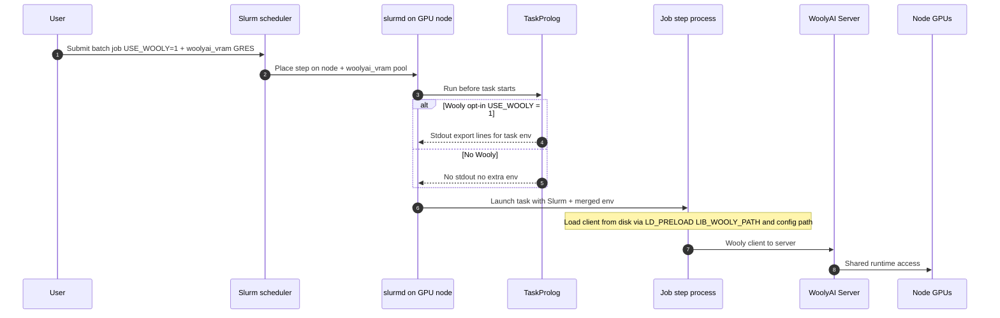

# Slurm usage guide

## Overview

What you need in one picture: Slurm still owns scheduling and GPU allocation; on each Wooly GPU node the **administrator** runs WoolyAI Server, installs the client on disk, and configures **TaskProlog** so job steps that **opt in** (a custom submit-time variable) pick up the client libraries and config without hand-rolling `export` lines in every script. Other jobs on the same node are unchanged. The **user** submits normal batch jobs and sets the flag when the workload uses Wooly; the application talks to the server through the client libraries.



This guide assumes you already run [Slurm](https://slurm.schedmd.com/) with **GPU scheduling** available on your nodes (for example through [GRES](https://slurm.schedmd.com/gres.html)). It focuses on **WoolyAI Server** on GPU nodes and **WoolyAI client libraries** used by batch jobs on those nodes.

Slurm schedules **where** jobs run and (with **`woolyai_vram`**) how much **VRAM budget** each Wooly job consumes from a per-node pool. **WoolyAI Server** performs **runtime sharing** of GPUs; **`CUDA_VISIBLE_DEVICES` is not used for Wooly server-side GPU assignment**—design capacity around **`woolyai_vram`**, **node Features**, **`--constraint`**, and **`wooly-client-config.toml`** (including optional **`GPUS`**). Slurm may still apply **device cgroups** on job steps depending on partition config; that is separate from Wooly admission.

## WoolyAI capacity: `woolyai_vram` GRES and node features

Standard Slurm **`gpu`** GRES **exclusively** assigns discrete devices. For Wooly-only workloads you typically want a **fungible VRAM pool** instead: jobs request **`--gres=woolyai_vram:<MiB>`**, Slurm decrements that pool for scheduling, and Wooly multiplexes real GPU use without Slurm binding specific devices for that resource.

### Admin: `GresTypes` and `gres.conf`

1. Add **`woolyai_vram`** to **`GresTypes`** in **`slurm.conf`** (comma-separated with any existing types, e.g. **`GresTypes=gpu,woolyai_vram`**).
2. On each Wooly GPU node, define the pool in **`gres.conf`**. Example (alongside NVML GPU autodetection):

   ```text
   AutoDetect=nvml
   Name=woolyai_vram Count=120000
   ```

   **`Count`** is the total schedulable **MiB** for **`woolyai_vram`** on that node (site policy: raw sum of GPU memory, a lower cap, etc.). Run **`slurmd -C`** and merge the reported **`Gres=`** into your **`NodeName=`** lines as required by your Slurm version.

3. Reload: **`scontrol reconfigure`**; restart **`slurmd`** on nodes if needed.

### Users: request VRAM only

Submitters set **`--gres=woolyai_vram:40000`** (example). They **do not** put **`WOOLYAI_RESERVED_VRAM_MIB`** in **`#SBATCH --export`**; **TaskProlog** (below) should set **`WOOLYAI_RESERVED_VRAM_MIB`** from the job’s allocated **`woolyai_vram`** so Wooly matches Slurm.

### Minimum GPUs on the host (e.g. NCCL)

To require **at least N physical GPUs** on the node **without** exclusive **`--gres=gpu:N`**, use **node Features** and **`--constraint`**:

- **Admin:** Set **`Feature=`** on each Wooly node, e.g. **`woolyai,woolyai_gpu_count_1`** or **`woolyai,woolyai_gpu_count_2`**, consistent site-wide.
- **Users:** **`#SBATCH --constraint=woolyai_gpu_count_2`** when they need a host with at least two GPUs. Combine with **`--gres=woolyai_vram:...`** as usual. Slurm **filters** nodes; it does **not** treat this like exclusive **`gpu:2`**.

### Partitioning GPUs: server scope, client `GPUS`, and Slurm

| Layer | What it controls |
| --- | --- |
| **Server launch** | Which physical devices the **server process** sees (often all node GPUs; can be narrowed with Docker **`--gpus`** or similar when starting the container). |
| **Client `GPUS` in `wooly-client-config.toml`** | Which **server** GPU indices this client targets. See [client setup](/client/setup). |
| **Slurm job** | **VRAM budget** via **`woolyai_vram`**, and **host topology** via **Features** / **`--constraint`**. |

**Practical patterns**

- Align **`woolyai_vram`** **`Count`** and TaskProlog-derived **`WOOLYAI_RESERVED_VRAM_MIB`** with Wooly server capacity.
- Use **`wooly-client-config.toml`** **`GPUS`** when client defaults do not match your host topology.
- Do not use exclusive **`--gres=gpu:N`** on Wooly queues if you want non-exclusive GPU tracking; use **Features** for “at least N GPUs” instead.

:::info One consumption model per GPU

Do not run WoolyAI multiplexing on the same physical GPU as unrelated exclusive CUDA jobs, Slurm **MPS**, or **shard** GRES on that same device. Use **dedicated partitions or node features** for WoolyAI nodes so Slurm never places classic whole-GPU jobs on silicon that WoolyAI is sharing across unrelated jobs.

:::

## Prerequisites

- Slurm scheduling GPU resources the way your site expects (partitions, **`--gres`** including **`woolyai_vram`** for Wooly VRAM pools, **`--constraint`** for node **Features**, etc.).
- NVIDIA drivers on GPU nodes, plus Docker (or your chosen runtime) for WoolyAI Server.
- A WoolyAI license and server image. See [Set up the WoolyAI Server](/server/setup).

**Recommended:** Reserve a **partition** or **node features** for WoolyAI-only GPU nodes so other job types do not share the same GPUs. That mirrors the separate pool idea in [deployment options](/deployment-options).

## 1. Run WoolyAI Server on each GPU node

On every Slurm GPU node that will run WoolyAI jobs:

1. Deploy WoolyAI Server with Docker (or systemd wrapping the same image), following [Set up the WoolyAI Server](/server/setup).
2. Pass through **all GPUs the node exposes to Slurm**, or the subset that WoolyAI owns on that node, with docker's `--gpus` (or equivalent) consistent with your node policy.
3. Ensure batch jobs on the host can reach the server address and port in `woolyai-server-config.toml` (for example **`--network=host`**, or **published ports** with bridge networking).

> **IMPORTANT:** The server should stay running **outside** individual `sbatch` jobs (daemon or node service), not started per job, unless your site explicitly designs lifecycle that way.

## 2. Install WoolyAI client libraries on each GPU node

**Cluster administrators** should install the client on **every GPU node** that runs WoolyAI jobs, before users submit work. Do not rely on jobs downloading or installing libraries at execution time.

1. Follow the instructions in [Install WoolyAI client libraries](/client/setup) to install the client libraries on the node up until the step after where you create the `wooly-client-config.toml` file. You don't need to run a docker container for slurm.
   - We highly recommend placing the client libraries in `/usr/local/lib/woolyai` and the client config in `/usr/local/etc/`.

The next section shows how **TaskProlog** injects Wooly-related environment (for example **`WOOLYAI_CLIENT_CONFIG`**, **`LD_PRELOAD`**, **`LIB_WOOLY_PATH`**) via **stdout `export` lines** only when jobs opt in with a **custom variable** at submit time, so users do not set those variables manually in every script.

## 3. Inject the client environment with TaskProlog

Slurm’s **`TaskProlog`** is one script path in **`slurm.conf`**; it runs for **every** job step on that node. To apply Wooly’s environment **only** when a job asks for it, the script checks a **custom variable** the user sets at submit time (here **`USE_WOOLY=1`**). If the variable is unset or not `1`, the script exits without printing anything and the task environment is unchanged.

Slurm runs the task prolog as the job’s user and parses **standard output**; lines of the form **`export name=value`** become environment variables for that task (see the [Prolog and Epilog Guide](https://slurm.schedmd.com/prolog_epilog.html)). **Plain `export` inside the prolog shell does nothing for the job**—only text **printed to stdout** is applied. Use **`echo "export VAR=..."`** (and send any debug text to **stderr**, e.g. **`echo "..." >&2`**, so it is not mistaken for an assignment).

**Users opt in** by passing the variable into the job environment, for example:

```bash
#SBATCH --export=ALL,USE_WOOLY=1
```

Use **`ALL`** (or whatever your site needs) so the job keeps its usual environment; append **`,USE_WOOLY=1`** so TaskProlog sees it. If your cluster uses a restrictive default for **`--export`**, document the correct form for your submitters.

Submitters request VRAM with **`--gres=woolyai_vram:<MiB>`**; TaskProlog sets **`WOOLYAI_RESERVED_VRAM_MIB`** from that allocation (see example below). Do not rely on users exporting **`WOOLYAI_RESERVED_VRAM_MIB`** manually unless you skip **`woolyai_vram`** GRES.

1. On each WoolyAI GPU node, install a root-owned script at **`/usr/local/bin/woolyai-task-prolog.sh`** (or your path) and make it executable (**`chmod 755`**).
2. In **`slurm.conf`** on those nodes, set a fully qualified path (Slurm does not search `PATH` for prolog programs):

   ```text
   TaskProlog=/usr/local/bin/woolyai-task-prolog.sh
   ```

   If only some nodes run WoolyAI, use a **node-specific** `slurm.conf` fragment, **`Include`**, or your config management so **`TaskProlog`** is set only on those hosts.

3. Example script: adjust paths and the opt-in variable name if your site standardizes something else (for example **`WOOLYAI_ENABLE`**).

```bash
#!/usr/bin/env bash
set -eo pipefail
# WoolyAI TaskProlog: inject env only when the job requested Wooly (USE_WOOLY=1).
# Slurm parses stdout for "export name=value" lines; do not use plain export alone.

if [[ "${USE_WOOLY:-}" != "1" ]]; then
  exit 0
fi

# Map allocated woolyai_vram (MiB) -> WOOLYAI_RESERVED_VRAM_MIB.
# VRAM is required for Wooly jobs: if mapping fails, fail TaskProlog and cancel task.
_woolyai_vram_mib=""
if [[ -z "${SLURM_JOB_ID:-}" ]] || ! command -v scontrol >/dev/null 2>&1; then
  echo "ERROR: cannot resolve woolyai_vram allocation (missing SLURM_JOB_ID or scontrol)." >&2
  exit 1
fi
_job_line=$(scontrol show job "${SLURM_JOB_ID}" -o 2>/dev/null || true)
_woolyai_vram_mib=""
if [[ "${_job_line}" =~ AllocTRES=[^[:space:]]*gres/woolyai_vram[:=]([0-9]+) ]]; then
  _woolyai_vram_mib="${BASH_REMATCH[1]}"
elif [[ "${_job_line}" =~ TresPerNode=[^[:space:]]*gres/woolyai_vram[:=]([0-9]+) ]]; then
  _woolyai_vram_mib="${BASH_REMATCH[1]}"
fi
if [[ -z "${_woolyai_vram_mib}" ]]; then
  echo "ERROR: woolyai_vram allocation not found for job ${SLURM_JOB_ID}; refusing to run without WOOLYAI_RESERVED_VRAM_MIB." >&2
  exit 1
fi
echo "export WOOLYAI_RESERVED_VRAM_MIB=${_woolyai_vram_mib}"

echo "export WOOLYAI_DEBUG=${WOOLYAI_DEBUG:-}"
echo "export WOOLYAI_CLIENT_CONFIG=/usr/local/etc/wooly-client-config.toml"
echo "export LD_PRELOAD=/usr/local/lib/libpreload_dlopen.so"
echo "export LIB_WOOLY_PATH=/usr/local/lib"
```

   Slurm reads those **`export`** lines from **stdout** and applies them to the task, as in the [SchedMD TaskProlog example](https://slurm.schedmd.com/prolog_epilog.html).

4. Reload or restart **`slurmd`** after changing **`TaskProlog`**.

You can **layer** an extra check (for example an allowlist of **`SLURM_JOB_PARTITION`**) inside the same script if you want defense in depth.

This guide assumes TaskProlog is used to inject Wooly environment. If your site does not use TaskProlog, provide equivalent automatic injection with **environment modules** or **SPANK** (including **`WOOLYAI_CLIENT_CONFIG`**, **`LD_PRELOAD`**, **`LIB_WOOLY_PATH`**, and **`WOOLYAI_RESERVED_VRAM_MIB`**).

## 4. Example batch script

Adjust partition names for your site. With **TaskProlog** configured as in section 3, Wooly jobs need **`USE_WOOLY=1`** in the job environment (via **`#SBATCH --export`**) but do not need **`LD_PRELOAD`**, **`LIB_WOOLY_PATH`**, or **`WOOLYAI_CLIENT_CONFIG`** in the script body. Request VRAM with **`--gres=woolyai_vram:<MiB>`**; TaskProlog sets **`WOOLYAI_RESERVED_VRAM_MIB`**. For multi-GPU hosts (e.g. NCCL), add **`--constraint=woolyai_gpu_count_2`** if your admins defined that **Feature**.

```bash
#!/bin/bash
#SBATCH --job-name=wooly-test
#SBATCH --partition=gpu-wooly
#SBATCH --export=ALL,USE_WOOLY=1,WOOLYAI_DEBUG=1
#SBATCH --nodes=1
#SBATCH --ntasks=1
#SBATCH --gres=woolyai_vram:40000
#SBATCH --time=01:00:00

set -euo pipefail

# wooly-client-config.toml GPUS (optional) targets server GPU indices.

python your_training_or_inference.py
```

If jobs run **inside Apptainer/Singularity**, the image must see the same libraries and config (bake them into the image or **bind-mount** the admin directories from the host). The administrator still provisions those bits on the node or in the approved image; the job script should not perform a fresh client install.

## 5. Slurm cgroups and device policy

**Wooly does not use `CUDA_VISIBLE_DEVICES` for server-side assignment**; do not center Wooly capacity docs on that variable. Slurm may still apply **device cgroups** to job steps depending on partition settings and whether jobs request standard **`gpu`** GRES. Document your site’s policy for Wooly GPU nodes (for example how **`task/cgroup`** interacts with **`/dev/nvidia*`** on a Wooly-only partition). That policy is **orthogonal** to **`woolyai_vram`** scheduling.

## 6. Optional integrations

- **Cluster Prolog / Epilog** (`slurm.conf` **Prolog** / **Epilog**, not TaskProlog): Run as root on the node for health checks, logging, or cleanup. See the [Prolog and Epilog Guide](https://slurm.schedmd.com/prolog_epilog.html).
- **WoolyAI Controller**: If you use the controller for routing, configure the client’s `CONTROLLER_URL` and related fields per [client setup](/client/setup) instead of direct `ADDRESS` / `PORT`.
