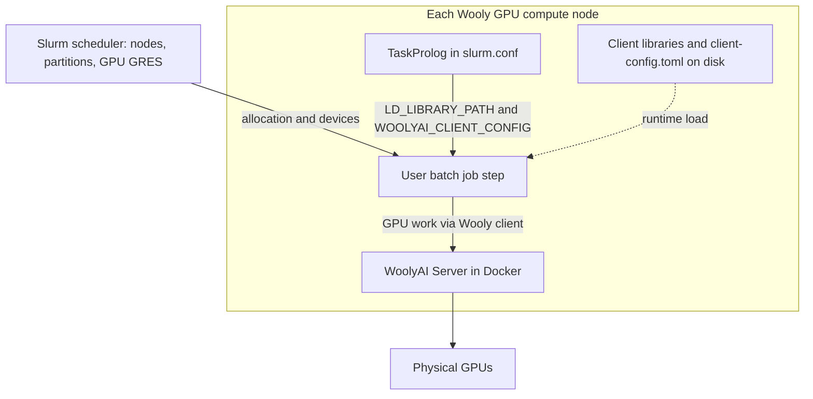

# Slurm usage guide

## Overview

What you need in one picture: Slurm still owns scheduling and GPU allocation; on each Wooly GPU node the **administrator** runs WoolyAI Server, installs the client on disk, and configures **TaskProlog** so job steps pick up the client environment automatically. The **user** submits normal batch jobs; the application talks to the server through the client libraries.



This guide assumes you already run [Slurm](https://slurm.schedmd.com/) with **GPU scheduling** available on your nodes (for example through [GRES](https://slurm.schedmd.com/gres.html)). It focuses on **WoolyAI Server** on GPU nodes and **WoolyAI client libraries** used by batch jobs on those nodes.

Slurm decides **which jobs may use which GPUs**. WoolyAI Server performs **runtime sharing** of those GPUs for workloads that use the client libraries.

## How the pieces fit together

1. **Slurm** allocates nodes, CPUs, memory, and GPU devices (or MIG instances). It sets `CUDA_VISIBLE_DEVICES` and cgroups so each job sees only its assigned devices.
2. **WoolyAI Server** runs on each GPU node (typically as a long-lived Docker container) and mediates access to the GPUs for client processes. By default the server is started with access to **all GPUs on that node** (for example Docker **`--gpus all`**). If you start the server with a restricted view (for example **`CUDA_VISIBLE_DEVICES`** or **`--gpus "device=..."`** on the container), the server only ever manages **that subset**.
3. **WoolyAI client libraries** (`.so` files) must be **installed on each GPU node ahead of time** (cluster administrator). Jobs on the host load those libraries from disk; they are not installed or unpacked when the job starts. In **`client-config.toml`**, optional **`GPUS`** selects **which GPU indices on the server** the client uses (comma-separated, server-side numbering). If **`GPUS`** is omitted, the client uses the default described in [client setup](/client/setup) (typically a single server GPU index **`0`**).

### Partitioning GPUs: server scope, client `GPUS`, and Slurm

These layers are independent. If you partition GPUs (by job, by queue, or by config), keep them aligned.

| Layer | What it controls |
| --- | --- |
| **Server launch** | Which physical devices the **server process** sees (often all node GPUs; can be narrowed with **`CUDA_VISIBLE_DEVICES`** or Docker **`--gpus`** when starting the container). |
| **Client `GPUS` in `client-config.toml`** | Which of **the server’s** GPU indices this client targets (for example **`GPUS = 1`** or **`GPUS = 0,1`**). See [client setup](/client/setup). |
| **Slurm job** | Which devices the **job step** is allowed to use and how **`CUDA_VISIBLE_DEVICES`** is set for processes on the node. |

**Practical patterns**

- **Simplest:** Server sees **all** Wooly node GPUs; shared **`client-config.toml`** leaves **`GPUS` unset** (or set once per site after you verify behavior with your Slurm driver ordering). Slurm still enforces **which node and how many GPUs** the job requested; confirm in testing that client and Slurm agree on device mapping (see [NVIDIA `CUDA_DEVICE_ORDER`](https://docs.nvidia.com/cuda/cuda-c-programming-guide/index.html#env-vars) if indices disagree).
- **Explicit client partition:** Set **`GPUS`** in **`client-config.toml`** (or a per-job config) to the **server indices** that correspond to the GPUs Slurm gave this allocation. Required when the default client behavior does not match how you split GPUs across jobs.
- **Hard server partition:** Run the server with **fewer GPUs visible** at container start so it **cannot** touch the rest of the node (for example a Wooly pool on two of eight cards). Client **`GPUS`** then refers only to **that server’s** renumbered or visible set.

Slurm partitioning and Wooly **`GPUS`** both slice access; mismatches show up as wrong GPU, failures, or cross-job interference. Document your site’s chosen pattern for users.

:::info One consumption model per GPU

Do not run WoolyAI multiplexing on the same physical GPU as unrelated exclusive CUDA jobs, Slurm **MPS**, or **shard** GRES on that same device. Use **dedicated partitions or node features** for WoolyAI nodes so Slurm never places classic whole-GPU jobs on silicon that WoolyAI is sharing across unrelated jobs.

:::

## Prerequisites

- Slurm scheduling GPU resources the way your site expects (partitions, `--gres`, `--gpus-per-node`, etc.).
- NVIDIA drivers on GPU nodes, plus Docker (or your chosen runtime) for WoolyAI Server.
- A WoolyAI license and server image. See [Set up the WoolyAI Server](/server/setup).

**Recommended:** Reserve a **partition** or **node features** for WoolyAI-only GPU nodes so other job types do not share the same GPUs. That mirrors the separate pool idea in [deployment options](/deployment-options).

## 1. Run WoolyAI Server on each GPU node

On every Slurm GPU node that will run WoolyAI jobs:

1. Deploy WoolyAI Server with Docker (or systemd wrapping the same image), following [Set up the WoolyAI Server](/server/setup).
2. Pass through **all GPUs the node exposes to Slurm**, or the subset that WoolyAI owns on that node, with docker's `--gpus` (or equivalent) consistent with your node policy.
3. Ensure batch jobs on the host can reach the server address and port in `woolyai-server-config.toml` (for example **`--network=host`**, or **published ports** with bridge networking).

> **IMPORTANT:** The server should stay running **outside** individual `sbatch` jobs (daemon or node service), not started per job, unless your site explicitly designs lifecycle that way.

## 2. Install WoolyAI client libraries on each GPU node

**Cluster administrators** should install the client on **every GPU node** that runs WoolyAI jobs, before users submit work. Do not rely on jobs downloading or installing libraries at execution time.

1. Download the libraries from [WoolyAI client libraries releases](https://github.com/Wooly-AI/woolyai-client-libraries/releases) and place them in a **stable path on the node** (for example `/opt/woolyai/lib` or your environment-modules tree).
2. Install a **`client-config.toml`** on the node (or one per node if addresses differ) with defaults for that host:
   - **`ADDRESS` and `PORT`** (or **controller** settings) so clients reach the WoolyAI Server on that node.
   - Optional **`GPUS`**: comma-separated **server-side** GPU indices for clients that should target specific cards. Omit **`GPUS`** for the default client behavior (see [client setup](/client/setup)). If you partition GPUs with Slurm or with a **server** that only sees a subset of the node, set **`GPUS`** (or use multiple config files) so it matches your allocation model; see [Partitioning GPUs](#partitioning-gpus-server-scope-client-gpus-and-slurm) above.

Step-by-step install options (containers vs host paths) are in [Install WoolyAI client libraries](/client/setup). For Slurm, treat the **compute node filesystem** as the install target unless your site builds Apptainer/Singularity images that already include the same library build.

The next section shows how to set **`LD_LIBRARY_PATH`** and **`WOOLYAI_CLIENT_CONFIG`** for every job step with **TaskProlog**, so users do not need to export them in batch scripts.

## 3. Inject the client environment with TaskProlog

Use Slurm’s **`TaskProlog`** so every job step gets **`LD_LIBRARY_PATH`** and **`WOOLYAI_CLIENT_CONFIG`** without users exporting them in batch scripts. Slurm runs the task prolog as the job’s user and parses **standard output**; lines of the form **`export name=value`** become environment variables for that task (see the [Prolog and Epilog Guide](https://slurm.schedmd.com/prolog_epilog.html)).

1. On each WoolyAI GPU node, install an executable script (example path **`/etc/slurm/woolyai-task-prolog.sh`**) owned by root, mode `0755`.
2. In **`slurm.conf`** on those nodes, set a fully qualified path (Slurm does not search `PATH` for prolog programs):

   ```text
   TaskProlog=/etc/slurm/woolyai-task-prolog.sh
   ```

   If only some nodes run WoolyAI, use a **node-specific** `slurm.conf` fragment, **`Include`**, or your config management so **`TaskProlog`** is set only on those hosts.

3. Example script: adjust paths and optional partition allowlist for your site.

   ```bash
   #!/bin/bash
   # WoolyAI TaskProlog: prepend client libs and point at admin-installed config.

   # Optional: only set Wooly env on selected partitions (edit names).
   # case "${SLURM_JOB_PARTITION:-}" in
   #   gpu-wooly|wooly*) ;;
   #   *) exit 0 ;;
   # esac

   WOOLYAI_LIB=/opt/woolyai/lib
   WOOLYAI_CLIENT_CONFIG=/opt/woolyai/etc/client-config.toml

   # Prepend Wooly libs; $LD_LIBRARY_PATH expands when this script runs (user task env).
   echo "export LD_LIBRARY_PATH=${WOOLYAI_LIB}:${LD_LIBRARY_PATH:-}"
   echo "export WOOLYAI_CLIENT_CONFIG=${WOOLYAI_CLIENT_CONFIG}"
   ```

   Slurm reads those **`export`** lines from stdout and applies them to the task, as in the [SchedMD TaskProlog example](https://slurm.schedmd.com/prolog_epilog.html).

4. Reload or restart **`slurmd`** after changing **`TaskProlog`**.

If you do not use TaskProlog, users can still set **`LD_LIBRARY_PATH`** and **`WOOLYAI_CLIENT_CONFIG`** in the job script, or you can use **environment modules** or **SPANK** on the node.

**`GPUS` in `client-config.toml`** selects **server GPU indices**, not Slurm job IDs. It must stay consistent with **which GPUs the server manages** and **Slurm’s `CUDA_VISIBLE_DEVICES`** for that step whenever you partition by job. See [Partitioning GPUs](#partitioning-gpus-server-scope-client-gpus-and-slurm).

## 4. Example batch script

Adjust partition names and GRES for your site. With **TaskProlog** configured as in section 3, you do not need **`export LD_LIBRARY_PATH`** or **`export WOOLYAI_CLIENT_CONFIG`** in the script.

```bash
#!/bin/bash
#SBATCH --job-name=wooly-test
#SBATCH --partition=gpu-wooly
#SBATCH --nodes=1
#SBATCH --gres=gpu:1
#SBATCH --time=01:00:00

set -euo pipefail

# Slurm sets CUDA_VISIBLE_DEVICES for the job. If client-config.toml sets GPUS,
# those indices are on the server; they must match how you partition this job.

python your_training_or_inference.py
```

If jobs run **inside Apptainer/Singularity**, the image must see the same libraries and config (bake them into the image or **bind-mount** the admin directories from the host). The administrator still provisions those bits on the node or in the approved image; the job script should not perform a fresh client install.

## 5. Optional integrations

- **Cluster Prolog / Epilog** (`slurm.conf` **Prolog** / **Epilog**, not TaskProlog): Run as root on the node for health checks, logging, or cleanup. See the [Prolog and Epilog Guide](https://slurm.schedmd.com/prolog_epilog.html).
- **Custom GRES**: If you need Slurm to track “Wooly seats” or VRAM budgets separately from physical GPUs, you can define an additional GRES type and keep its counts aligned with policy (and with WoolyAI Server capacity). This is site-specific and may require **job submit plugins** or documentation so users request resources consistently.
- **WoolyAI Controller**: If you use the controller for routing, configure the client’s `CONTROLLER_URL` and related fields per [client setup](/client/setup) instead of direct `ADDRESS` / `PORT`.

## Troubleshooting

- **Wooly env vars missing in the job**: Confirm **`TaskProlog`** is set in **`slurm.conf`** on the compute node, the script path is absolute and executable, and **`slurmd`** was restarted. A non-zero exit from the task prolog **cancels the task**; check **`slurmd`** logs. If you use a partition guard in the script, confirm the job’s **`SLURM_JOB_PARTITION`** matches.
- **Wrong GPU or no GPU**: Compare **which GPUs the server** was started with (Docker **`--gpus`**, server-side **`CUDA_VISIBLE_DEVICES`**), **client `GPUS`** (server indices), Slurm’s **`CUDA_VISIBLE_DEVICES`**, and **`gres.conf` / `AutoDetect` ordering**. See [NVIDIA notes on `CUDA_DEVICE_ORDER=PCI_BUS_ID`](https://docs.nvidia.com/cuda/cuda-c-programming-guide/index.html#env-vars) if indices mismatch across tools. Review [Partitioning GPUs](#partitioning-gpus-server-scope-client-gpus-and-slurm).
- **Connection refused to server**: Confirm server listen address, firewall, and whether jobs use host networking versus container bridge.
- **Conflict with other workloads**: Ensure WoolyAI partitions do not share GPUs with exclusive non-Wooly jobs or with Slurm MPS/shard on the same device.

For WoolyAI-specific issues, see [Server troubleshooting](/server/troubleshooting) and [Client troubleshooting](/client/troubleshooting).
